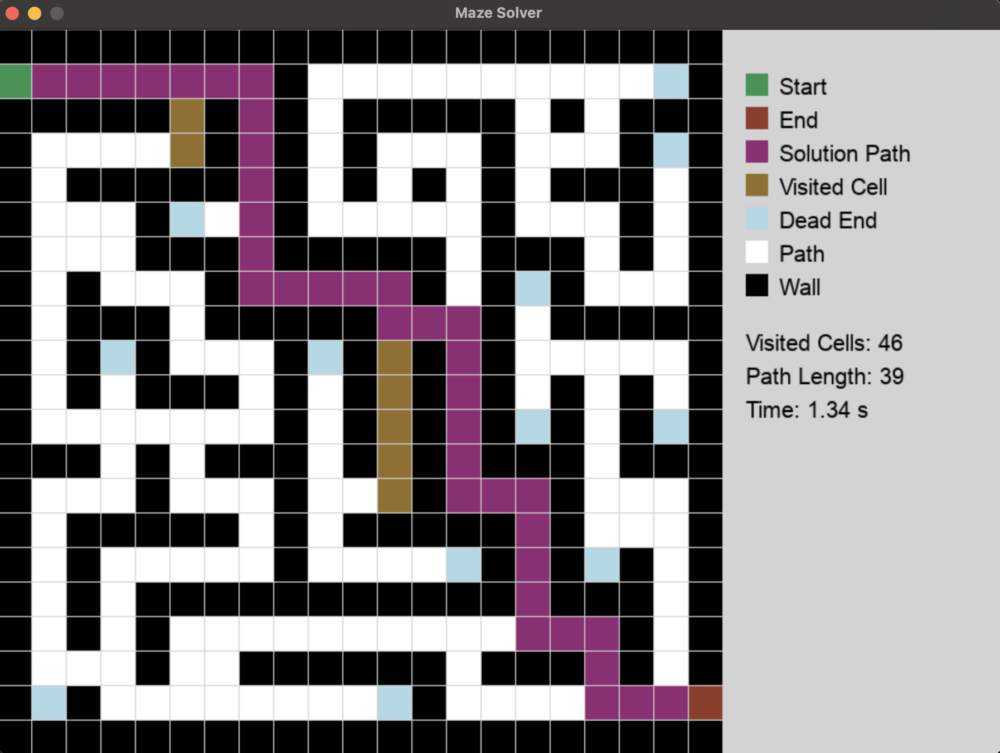

# 🌀 Maze Pathfinder

Animated maze generator and solver built with **Pygame** and the **A\*** search algorithm.  
Each run creates a new randomized maze, then visualizes the search process in real-time — walls, paths, dead-ends, and all.

---

## 🎮 Preview


*(Replace the image above with your own screenshot or GIF — see instructions below.)*

Run the app:
```bash
python Amisu_MazePathfinder.py
```
A new maze will appear, and the algorithm will animate its way from **Start (Green)** to **End (Red)**.

---

## ⚙️ Features
- 🧩 Random maze generation using **Depth-First Search (DFS)**
- 🚦 Shortest-path solving using **A\*** with Manhattan distance
- 🌈 **Animated visualization** of visited cells and solution
- 🧠 Dead-end detection and optional loop carving for natural mazes
- 📊 Live stats for:
  - Visited cells  
  - Path length  
  - Time elapsed

---

## 🧠 Legend

| Color | Meaning |
|:------|:--------|
| 🟩 Green | Start Point |
| 🟥 Red | End Point |
| 🟪 Purple | Solution Path |
| 🟫 Mustard | Visited Cell |
| 🩵 Light Blue | Dead End |
| ⚪ White | Open Path |
| ⚫ Black | Wall |

---

## 🚀 How to Run

### 1. Clone this repository
```bash
git clone https://github.com/<your-username>/maze-pathfinder.git
cd maze-pathfinder
```

### 2. Install dependencies
Make sure Python 3.x is installed, then:
```bash
pip install pygame
```

### 3. Run the program
```bash
python Amisu_MazePathfinder.py
```

Press **ESC** or close the window to exit.

---

## 🧩 Tech Stack
- **Python 3**
- **Pygame**
- **Heapq** for priority queue (A\* frontier)
- **Randomized DFS** for maze generation

---

## 🧑‍💻 Acknowledgments
Developed by **Haleemah “Tayo” Amisu**  
Portions of algorithmic optimization were assisted by Google’s **Gemini AI** for debugging and performance tuning.

---

## 💡 Ideas for Future Enhancements
- Add user-selectable maze sizes  
- Support multiple pathfinding algorithms (BFS, Dijkstra, etc.)  
- Save maze images or replays  
- Add restart or pause/resume options  

---

> “Every maze has a pattern — you just have to see it unfold.”
